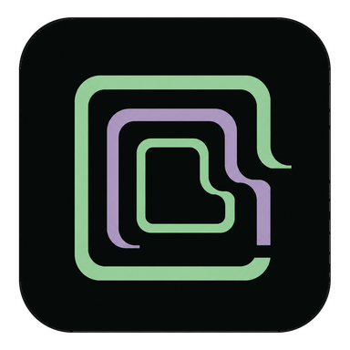

<p align="center">
  
</p>

# La Serre

> A local-first studio for writing, directing and producing generative series without surrendering creative control to AI.

[Version 0.2.13](apps/version.py) · [Main README in French](README.md) · [Quick start](#quick-start) · [Documentation](#documentation) · [Roadmap](docs/roadmap.md) · [Contributing](CONTRIBUTING.md) · [Security](SECURITY.md) · [License](LICENSE)

**Status: active alpha.** The local core, Windows app, canonical Story Bible, assisted writing, navigable graphs and multi-shot production pipeline are implemented. Cross-episode identity locking is the next major product milestone.

## What is La Serre?

Generating one attractive asset is no longer the hard part. Producing a coherent series still is. La Serre keeps story state, character identity, performance intent, visual continuity, model provenance, variants and human approvals connected through one production graph.

> **AI proposes. The human edits, approves and owns the decision.**

Every stage can be powered by local AI, manual input, drag-and-drop media or an existing project asset. Approved work is never silently overwritten.

## Available today

- a six-stage guided episode journey and navigable Series → Episode → Shot graphs;
- Ollama-powered direction, writing, review and contextual field suggestions;
- a versioned canonical Bible for characters, places, relations, art direction and story arcs;
- strict JSON Bible exchange plus a ChatGPT transformation kit;
- code-generated FLUX, SDXL and LTX continuity workflow templates;
- interchangeable generated or imported text, image, audio and video assets;
- explicit human gates, provenance, history, variants and impact tracking;
- multi-shot FFmpeg assembly with voices, music, ambience and subtitles;
- isolated local projects, a production queue and a Windows desktop shell.

The Express Demo explains the workflow without a GPU. Final image and video quality requires ComfyUI and user-selected models.

## Quick start

Requirements: Windows, Git and Python 3.12+.

```powershell
git clone https://github.com/Slimtrat/La_Serre.git
cd La_Serre
python -m venv .venv
.venv\Scripts\Activate.ps1
python -m pip install -e ".[dev]"
Copy-Item .env.example .env
python -m tools.run_studio
```

Open **Tools → Express Demo** to test the path without ComfyUI. For the full local pipeline, start Ollama, install the recommended narrative model from Settings, start ComfyUI, generate the Studio workflows and download only the listed media models.

Large model weights are neither bundled nor downloaded silently.

## Documentation

| Topic | Guide |
|---|---|
| Product direction and milestones | [Roadmap](docs/roadmap.md) |
| Domain and adapter boundaries | [Architecture](docs/architecture.md) |
| Replaceable AI/import/manual stages | [Hybrid pipeline](docs/hybrid-pipeline.md) |
| Series and episode writing | [Narrative authoring](docs/narrative-authoring.md) |
| Consistency checks and human gates | [Narrative coherence](docs/narrative-coherence.md) |
| Portable Bible JSON and ChatGPT kit | [Bible exchange](docs/bible-exchange.md) |
| ComfyUI integration | [ComfyUI guide](docs/comfyui.md) |
| Visual-continuity recipes | [Workflow templates](docs/workflow-templates.md) |
| Final episode contract | [Production contract](docs/episode-production-contract.md) |
| Versions and variants | [Editorial history](docs/editorial-history.md) |
| Local project directories | [Project storage](docs/project-storage.md) |
| Windows background behavior | [Desktop lifecycle](docs/desktop-lifecycle.md) |

Most technical guides are currently written in French. English documentation contributions are welcome.

## Contributing

Install all development dependencies and run the quality gates before opening a pull request:

```powershell
python -m pip install -e ".[dev,desktop,build]"
ruff check apps engine tools tests
mypy apps engine tools
pytest
```

Read [CONTRIBUTING.md](CONTRIBUTING.md) for architecture rules and the pull-request checklist. Keep private Bibles, model weights and generated media out of commits.

## Direction

The next product proof is **three coherent episodes produced without hand-editing workflow JSON**. The long-term ambition is a creative production operating system with canonical continuity, interchangeable engines, optional distributed rendering, social formats, collaboration and an open recipe ecosystem.

See the detailed [product roadmap](docs/roadmap.md) and discuss proposals in [GitHub Issues](https://github.com/Slimtrat/La_Serre/issues).

## License

The source code is licensed under **GNU AGPL v3.0 or later**. Modified distributions and network services must provide the corresponding source under the license terms. See [LICENSE](LICENSE).
