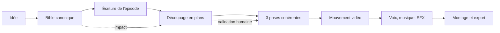

<p align="center">
  
</p>

# La Serre

> Un studio local-first pour écrire, mettre en scène et produire des séries génératives sans abandonner la direction créative à l’IA.

[](apps/version.py)
[](pyproject.toml)
[](LICENSE)
[](docs/desktop-lifecycle.md)

**Statut : alpha active.** Le cœur local, l’application Windows, la Bible canonique, l’écriture assistée, les graphes et la chaîne de production multi-plans fonctionnent déjà. Les modèles lourds restent externes et le verrouillage d’identité sur plusieurs épisodes est le prochain grand jalon.

[English overview](README.en.md) · [Démarrage](#démarrage-rapide) · [Fonctions actuelles](#ce-qui-fonctionne-aujourdhui) · [Documentation](#documentation) · [Roadmap](docs/roadmap.md) · [Contribuer](CONTRIBUTING.md) · [Sécurité](SECURITY.md) · [Licence](LICENSE)

## Pourquoi La Serre ?

Générer une belle image est devenu accessible. Produire une série cohérente reste difficile : il faut maintenir les personnages, les lieux, les relations, les intentions de jeu, les dialogues, les raccords visuels, les modèles utilisés et les décisions humaines sur des dizaines d’artefacts.

La Serre traite cette difficulté comme un problème de **production**, pas comme une succession de prompts.



Le contrat produit est simple :

> **L’IA propose. L’humain édite, valide et reste propriétaire de la décision.**

Chaque étape peut utiliser un modèle local, un fichier glissé-déposé ou une saisie manuelle. Aucun artefact approuvé ne doit être remplacé silencieusement.

## Ce qui fonctionne aujourd’hui

| Domaine | Capacité disponible en `0.2.13` |
|---|---|
| Parcours créatif | Chemin guidé en six étapes, graphe navigable, caméra automatique et retour vers les objets métier |
| Écriture | Director, scénariste et validateur via Ollama, suggestions contextuelles, dialogues et intentions de jeu |
| Bible | Personnages, lieux, relations, direction artistique, règles, arcs et secrets versionnés |
| Échange IA | Export/import JSON strict et kit permettant à ChatGPT de transformer une conversation en Bible |
| Continuité visuelle | Templates générés par le code pour FLUX, SDXL, poses adjacentes et animation LTX à trois guides |
| Production hybride | Texte, image, son et vidéo peuvent venir d’un modèle, d’un import ou d’un asset existant |
| Contrôle humain | Gates explicites, provenance, historique, variantes, restauration et signalement des impacts |
| Montage | Production multi-plans avec voix, musique, ambiance, sous-titres et assemblage FFmpeg |
| Exploitation locale | Projets isolés, stockage configurable, queue de production et gestion d’Ollama/ComfyUI |
| Desktop | Application Windows, fonctionnement en arrière-plan, notifications et build portable |

La démo express fonctionne sans GPU et permet de comprendre le parcours. La qualité image/vidéo finale demande ComfyUI et les modèles choisis par l’utilisateur.

## Démarrage rapide

### 1. Installer le Studio

Prérequis : **Windows**, **Git** et **Python 3.12 ou supérieur**.

```powershell
git clone https://github.com/Slimtrat/La_Serre.git
cd La_Serre

python -m venv .venv
.venv\Scripts\Activate.ps1
python -m pip install -e ".[dev]"
Copy-Item .env.example .env
```

### 2. Lancer l’interface locale

```powershell
python -m tools.run_studio
```

Le navigateur ouvre le Studio sur `http://127.0.0.1:8000`. Utilisez **Outils → Démo express** pour tester le parcours sans ComfyUI.

### 3. Activer la génération locale complète

1. installez et démarrez [Ollama](https://ollama.com/) ;
2. ouvrez **Réglages → Modèles narratifs** pour installer le modèle recommandé ;
3. installez et démarrez [ComfyUI](https://github.com/comfyanonymous/ComfyUI) ;
4. ouvrez **Réglages → ComfyUI & workflows** puis créez les workflows ;
5. téléchargez uniquement les modèles listés dans **Modèles image & vidéo**.

Les poids de modèles ne sont jamais inclus dans le dépôt ni téléchargés silencieusement.

### Application Windows

```powershell
python -m pip install -e ".[desktop]"
python -m apps.desktop
```

La construction de l’exécutable et de l’installeur est documentée par le [workflow Windows](.github/workflows/windows-desktop.yml).

## Architecture en une minute

```text
apps/       API FastAPI, interface web locale et shell desktop
engine/     contrats narratifs, Bible, génération et production
workflows/  recettes ComfyUI générées et templates versionnés
tools/      commandes de lancement, génération et packaging
tests/      contrats unitaires, API, intégration et smoke tests navigateur
docs/       décisions d’architecture et guides spécialisés
```

Le domaine ne dépend pas des numéros de nœuds ComfyUI. Les profils traduisent des champs sémantiques comme `prompt`, `seed` ou `reference_image` vers un graphe généré par le code. Les artefacts externes et générés suivent les mêmes contrats.

## Documentation

| Je veux… | Lire |
|---|---|
| comprendre les frontières du code | [Architecture](docs/architecture.md) |
| voir la vision court, moyen et long terme | [Roadmap produit](docs/roadmap.md) |
| comprendre le pipeline remplaçable | [Pipeline hybride](docs/hybrid-pipeline.md) |
| écrire une série et ses épisodes | [Atelier narratif](docs/narrative-authoring.md) |
| comprendre les contrôles de cohérence | [Cohérence narrative](docs/narrative-coherence.md) |
| échanger une Bible avec ChatGPT | [Format d’échange de Bible](docs/bible-exchange.md) |
| installer et relier ComfyUI | [Guide ComfyUI](docs/comfyui.md) |
| choisir un template de continuité | [Templates de workflows](docs/workflow-templates.md) |
| connaître le contrat d’un épisode final | [Contrat de production](docs/episode-production-contract.md) |
| comprendre versions et variantes | [Historique éditorial](docs/editorial-history.md) |
| configurer les dossiers de projets | [Stockage des projets](docs/project-storage.md) |
| utiliser le mode desktop | [Cycle de vie Windows](docs/desktop-lifecycle.md) |

## Développer et vérifier

```powershell
python -m pip install -e ".[dev,desktop,build]"
ruff check apps engine tools tests
mypy apps engine tools
pytest
```

Les pull requests doivent préserver quatre invariants : édition manuelle possible, validation humaine explicite, provenance des artefacts et absence de dépendance cachée à un modèle particulier. Le guide complet se trouve dans [CONTRIBUTING.md](CONTRIBUTING.md).

## Données privées et modèles tiers

- `.private/`, `projects/`, `output/`, `logs/` et `workflows/local/` sont ignorés par Git ;
- ne publiez jamais une Bible, un modèle, un prompt privé ou un média sans disposer des droits nécessaires ;
- Ollama, ComfyUI, FFmpeg et les modèles téléchargés conservent leurs propres licences ;
- l’API écoute sur localhost par défaut et n’est pas conçue pour être exposée directement à Internet.

Consultez [SECURITY.md](SECURITY.md) avant de signaler une vulnérabilité ou de déployer le Studio sur un réseau.

## Roadmap et ambition

Le prochain test produit n’est pas « une génération de plus », mais **trois épisodes cohérents produits sans bricoler de JSON**. La suite vise un véritable système d’exploitation créatif : continuité canonique, moteurs interchangeables, production distribuée optionnelle, formats sociaux, collaboration et écosystème de recettes.

La vision détaillée, ses critères d’acceptation et ses limites sont dans la [roadmap produit](docs/roadmap.md). Les propositions se discutent dans les [issues GitHub](https://github.com/Slimtrat/La_Serre/issues).

## Licence

Le code est distribué sous **GNU Affero General Public License v3.0 ou ultérieure** (`AGPL-3.0-or-later`). Vous pouvez l’utiliser, l’étudier et le modifier ; si vous distribuez une version modifiée ou la rendez accessible comme service réseau, vous devez mettre le code source correspondant à disposition selon les termes de la licence.

Voir le texte complet dans [LICENSE](LICENSE). Les contributions sont acceptées sous la même licence.
