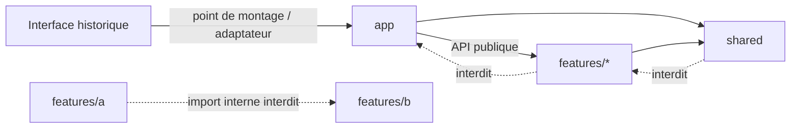

# ADR — Architecture frontend orientée fonctionnalités

- Statut : accepté
- Date : 2026-09-08
- Portée : `frontend/src/`

## Contexte

Le Studio migre progressivement de son interface historique vers React et TypeScript. Cette
cohabitation doit permettre de livrer chaque parcours indépendamment, sans recréer un monolithe
frontend ni exposer les détails internes d'une fonctionnalité au reste de l'application.

## Décision

Le code React suit une architecture **feature-first** composée de trois zones :

```text
frontend/src/
├── app/       # composition, démarrage, routage et fournisseurs globaux
├── shared/    # briques génériques sans connaissance métier
└── features/  # capacités métier autonomes
```

Le sens des dépendances est unique :



### Responsabilités

- `app/` assemble l'application : racines React, routes, providers globaux, configuration et
  adaptateurs avec le shell historique. Il ne contient pas de logique métier.
- `shared/` contient uniquement des éléments réutilisables et agnostiques du métier : primitives
  d'interface, client HTTP, utilitaires, types techniques et outils de test.
- `features/<feature>/` possède un parcours métier de bout en bout : interface, état, appels API,
  validation et tests.

### API publiques et imports autorisés

Chaque feature expose son contrat dans `features/<feature>/index.ts`. Le reste du frontend importe
uniquement ce point d'entrée :

```ts
import { ProjectPicker } from "@/features/project-picker";
```

Un import profond tel que
`@/features/project-picker/components/ProjectPicker` est interdit hors de cette feature. Les
éléments non exportés par `index.ts` sont privés et peuvent évoluer sans affecter leurs
consommateurs.

Règles d'import :

| Depuis | Peut importer | Ne peut pas importer |
| --- | --- | --- |
| `app/` | `features/*` via leur `index.ts`, `shared/*` | les modules internes d'une feature |
| `features/<x>/` | ses propres modules, `shared/*`, l’API publique d’une autre feature | `app/*`, les modules internes d’une autre feature |
| `shared/` | d'autres modules `shared/*` de niveau inférieur | `app/*`, `features/*` |

Une feature peut consommer l’API publique d’une autre feature lorsque cette dépendance métier est
intentionnelle. Lorsqu’un contrat est réellement commun, il est extrait dans `shared/` ; lorsque
deux features doivent être orchestrées sans dépendance métier directe, `app/` réalise la
composition par propriétés, callbacks ou services injectés.

Les alias TypeScript (`@/…`) sont préférés aux longues remontées relatives entre zones. Les imports
relatifs restent adaptés à l'intérieur d'un même module ou d'une même feature.

### Placement d'un changement

Pour une feature nommée `project-picker`, la structure de référence est :

```text
features/project-picker/
├── index.ts                       # API publique minimale
├── components/
│   ├── ProjectPicker.tsx
│   ├── ProjectPicker.module.css
│   └── ProjectPicker.test.tsx
├── hooks/
│   └── useProjects.ts
├── api/
│   └── getProjects.ts
├── schemas/
│   └── project.schema.ts
└── test/
    └── fixtures.ts
```

- Un **composant** se place dans `components/`; son test et ses styles restent au plus près.
- Un **hook** se place dans `hooks/`; il orchestre l'état React, pas le transport HTTP.
- Une **requête** se place dans `api/`; elle s'appuie sur le client HTTP de `shared/` et retourne un
  résultat typé.
- Un **schéma** de validation ou de décodage se place dans `schemas/`; les types dérivés qui font
  partie du contrat public sont réexportés par `index.ts`.
- Un **test** unitaire est colocalisé avec l'unité testée. Les fixtures partagées à la feature vont
  dans `test/`; les helpers utilisables par plusieurs features vont dans `shared/test/`.
- Les **styles** propres à un composant sont colocalisés, de préférence dans un module CSS. Les
  tokens et styles véritablement globaux résident dans `app/styles/` ou `shared/styles/` selon leur
  responsabilité.

Tous ces sous-dossiers sont facultatifs : on ne crée que ceux dont la feature a besoin.

### Modèle de feature pour Codex

Lorsqu'un agent ajoute une feature, il suit ce contrat :

1. créer `frontend/src/features/<nom-kebab-case>/` et identifier une responsabilité métier unique ;
2. implémenter composants, hooks, API, schémas, tests et styles aux emplacements ci-dessus ;
3. exposer dans `index.ts` uniquement ce dont `app/` a besoin ;
4. composer la feature depuis `app/`, sans importer ses fichiers internes ;
5. ajouter ou adapter les tests au même moment que le comportement ;
6. exécuter le typecheck, les tests frontend concernés, le build et le smoke pertinent ;
7. ne pas déplacer du code legacy sans que le parcours migré soit couvert et raccordé.

Ce modèle est une contrainte d'architecture, pas une invitation à générer tous les répertoires par
défaut.

## Migration par étranglement du legacy

La migration suit le patron de l'étrangleur : le shell historique demeure opérationnel pendant que
des îlots React remplacent un parcours cohérent à la fois.

Pour chaque tranche :

1. documenter le comportement observable et ajouter les tests qui le sécurisent ;
2. créer la feature React derrière un point de montage contrôlé par `app/` ;
3. faire transiter les accès au backend par les mêmes API FastAPI, via les adaptateurs partagés ;
4. basculer le parcours complet vers React ;
5. supprimer le code historique devenu sans appel, ses styles et son point de montage ;
6. vérifier les parcours adjacents et le packaging desktop.

On évite une réécriture globale, ainsi que la duplication durable d'une même règle métier dans les
deux interfaces. Pendant une transition, le contrat avec le legacy est explicite, minimal et placé
dans `app/`; le code nouveau ne dépend jamais directement des détails DOM ou des variables globales
historiques.

## CSS et framework

Cette décision ne sélectionne pas de framework CSS. Le choix, l'évaluation de la réduction du CSS
maintenu, la stratégie de tokens et l'éventuelle migration sont volontairement différés à **F05**.
Jusqu'à cette décision, les ajouts privilégient des styles locaux, sobres et colocalisés, sans
introduire une nouvelle dépendance CSS ni lancer une migration transversale.

## Conséquences

L'organisation par capacité métier rend les changements localisables, les tests plus proches du
code et la suppression du legacy progressive. Elle impose en contrepartie de maintenir des API
publiques étroites et de refuser les imports profonds, même lorsqu'ils semblent plus rapides à
court terme.
